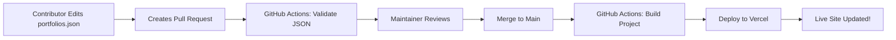

# 🚀 Deployment Guide

This guide will help you set up automatic deployment for DevFolio Showcase using Vercel and GitHub Actions.

## 📋 Prerequisites

- GitHub account
- Vercel account (free tier works perfectly)
- Repository pushed to GitHub

## 🔧 Step 1: Deploy to Vercel

### Option A: Vercel Dashboard (Recommended for First Time)

1. Go to [Vercel Dashboard](https://vercel.com/dashboard)
2. Click "Add New Project"
3. Import your GitHub repository
4. Configure project settings:
   - **Framework Preset:** Vite
   - **Root Directory:** `./`
   - **Build Command:** `npm run build`
   - **Output Directory:** `dist`
5. Add Environment Variable:
   - **Name:** `GEMINI_API_KEY`
   - **Value:** Your Gemini API key
6. Click "Deploy"

### Option B: Vercel CLI

```bash
# Install Vercel CLI
npm i -g vercel

# Login to Vercel
vercel login

# Deploy
vercel

# Deploy to production
vercel --prod
```

## 🤖 Step 2: Set Up GitHub Actions (Auto-Deployment)

### Get Vercel Tokens

1. Go to [Vercel Account Settings](https://vercel.com/account/tokens)
2. Create a new token
3. Copy the token (you'll need it for GitHub Secrets)

### Get Vercel Project IDs

```bash
# Install Vercel CLI if not already installed
npm i -g vercel

# Link your project
vercel link

# Get your Org ID and Project ID
cat .vercel/project.json
```

You'll see something like:
```json
{
  "orgId": "team_xxxxxxxxxxxxx",
  "projectId": "prj_xxxxxxxxxxxxx"
}
```

### Add GitHub Secrets

1. Go to your GitHub repository
2. Navigate to **Settings** → **Secrets and variables** → **Actions**
3. Click "New repository secret"
4. Add these three secrets:

| Secret Name | Value | Description |
|-------------|-------|-------------|
| `VERCEL_TOKEN` | Your Vercel token | From Vercel account settings |
| `VERCEL_ORG_ID` | Your org/team ID | From `.vercel/project.json` |
| `VERCEL_PROJECT_ID` | Your project ID | From `.vercel/project.json` |

### Verify GitHub Actions

1. Go to **Actions** tab in your repository
2. You should see the "Deploy to Vercel" workflow
3. Push a commit to `main` branch to trigger deployment

## ✅ Step 3: Test the Workflow

### Test Automatic Deployment

1. Make a small change (e.g., edit `README.md`)
2. Commit and push to `main`:
   ```bash
   git add .
   git commit -m "Test auto-deployment"
   git push origin main
   ```
3. Go to GitHub Actions tab
4. Watch the deployment workflow run
5. Once complete, check your Vercel URL

### Test Portfolio Addition

1. Edit `src/data/portfolios.json`
2. Add a new portfolio entry
3. Commit and push
4. Wait for auto-deployment (usually 2-5 minutes)
5. Visit your live site - new portfolio should appear!

## 🔄 How Auto-Deployment Works



### Workflow Steps:

1. **On Pull Request:**
   - Validates JSON format
   - Runs build to check for errors
   - Shows status check on PR

2. **On Merge to Main:**
   - Validates JSON again
   - Builds the project
   - Deploys to Vercel production
   - Site updates within 5 minutes

## 🐛 Troubleshooting

### Deployment Fails

**Check GitHub Actions logs:**
1. Go to Actions tab
2. Click on failed workflow
3. Check error messages

**Common issues:**
- Invalid JSON in `portfolios.json`
- Missing environment variables
- Build errors in code

### Vercel Deployment Issues

**Check Vercel dashboard:**
1. Go to your project on Vercel
2. Click "Deployments"
3. Check failed deployment logs

**Common fixes:**
- Verify `GEMINI_API_KEY` is set in Vercel
- Check build command is correct
- Ensure all dependencies are in `package.json`

### GitHub Actions Not Running

**Verify:**
- Workflow file exists at `.github/workflows/deploy.yml`
- GitHub Actions is enabled in repository settings
- All three secrets are added correctly
- Secret names match exactly (case-sensitive)

## 🔐 Security Best Practices

1. **Never commit secrets** to the repository
2. **Use GitHub Secrets** for sensitive data
3. **Rotate tokens** periodically
4. **Limit token permissions** to only what's needed
5. **Review PRs carefully** before merging

## 📊 Monitoring Deployments

### Vercel Dashboard
- View deployment history
- Check build logs
- Monitor performance
- View analytics

### GitHub Actions
- See all workflow runs
- Check build times
- View deployment status
- Download artifacts

## 🎯 Production Checklist

Before going live, ensure:

- [ ] Vercel project is deployed successfully
- [ ] Environment variables are set
- [ ] GitHub Actions workflow is working
- [ ] All three secrets are configured
- [ ] Test deployment works end-to-end
- [ ] Custom domain configured (optional)
- [ ] Analytics enabled (optional)
- [ ] Error monitoring set up (optional)

## 🌐 Custom Domain (Optional)

1. Go to Vercel project settings
2. Navigate to "Domains"
3. Add your custom domain
4. Follow DNS configuration instructions
5. Wait for DNS propagation (up to 48 hours)

## 📈 Next Steps

- Set up [Vercel Analytics](https://vercel.com/analytics)
- Configure [Vercel Speed Insights](https://vercel.com/docs/speed-insights)
- Add [Sentry](https://sentry.io) for error tracking
- Set up [Lighthouse CI](https://github.com/GoogleChrome/lighthouse-ci) for performance monitoring

## 🆘 Need Help?

- 📖 [Vercel Documentation](https://vercel.com/docs)
- 📖 [GitHub Actions Documentation](https://docs.github.com/en/actions)
- 💬 [Open an Issue](../../issues/new)
- 📧 Contact maintainers

---

**Happy Deploying!** 🚀✨
